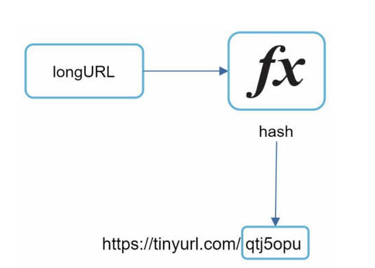
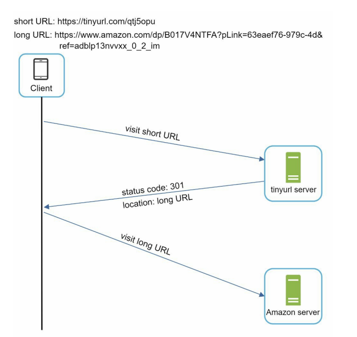

# Url Shortener

## Objective

Design and implement an url shortener.

## Requirements

* Basic use cases:
    * URL shortening: Given a long url => return a short url.
    * URL redirecting: Given a short url => redirect to original url.
* Allowed characters in shortened url: [0-9], [a-z], [A-Z], '_'.
* Length of the shortened url: 11
* Shortened urls can't be updated or deleted.
* Idempotent: shortening the same url should give same results.
* Reverse lookups are not allowed - checking what is the shortened url for a given long url.

## High Level Design

### Service Layer

We will be implementing following API endpoints:

#### URL Creation

Clients will use this API endpoint to create new short urls. To support url shortening use case, we will use appropriate
hash function fx that maps a long url to a hash value, and will be returned as shortened url -
`www.example.com/<hashValue>`. We will explore multiple option for hash functions below.



##### API Parameters:

* Request type: POST
* Url endpoint: `/create`
* Request parameters:

```
{
  string longUrl: Url which needs to be shortened.
}
```

* Response parameters:

```
{
  string shortUrl: Shortened url.
}
```

##### Hash functions:

We will use CRC32 hash function for initial testing version and later we will optimize. For list of hash functions,
see [this tool](https://www.fileformat.info/tool/hash.htm?text=http%3A%2F%2Fforums.construx.com%2Fblogs%2Fstevemcc%2Fdefault.aspx)
and [wikipedia](https://en.wikipedia.org/wiki/List_of_hash_functions).

TODO: Explore more on hash functions suitable for our usecase.

##### Validations

Validate that:

* Input url provided is a valid url.
* Input url provided is not an already shortened url created by our service.

#### URL Redirect

This endpoint is called by clients to redirect them to the long url.

##### API Parameters;

* Request type: GET
* Url endpoint: `/<shortUrl>`

##### HTTP Redirection

We have multiple redirect options([full list](https://developer.mozilla.org/en-US/docs/Web/HTTP/Redirections) of
redirect options):
* [Option 1] 301 redirect: A 301 redirect shows that the requested URL is “permanently” moved to the
  long URL. Since it is permanently redirected, the browser caches the response, and
  subsequent requests for the same URL will not be sent to the URL shortening service.
  Instead, requests are redirected to the long URL server directly.
* [Option 2] 302 redirect: A 302 redirect means that the URL is “temporarily” moved to the long URL,
  meaning that subsequent requests for the same URL will be sent to the URL shortening
  service first. Then, they are redirected to the long URL server.

We chose **[Option 1] - 301 redirect** as it will reduce the load on our server.



### Storage Layer

For initial testing version, we will use an in-memory storage, and later enhance it.

TODO: Explore more for Sql vs No-sql databases, bloom filters, etc.
